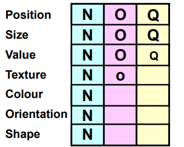
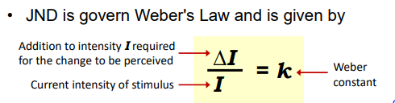

# 数据可视化笔记

这是南洋理工大学数据科学专业的数据可视化笔记。大量精简，仅供参考。

## 第一章：介绍：

### 1.最好的可视化方案依赖于：

    1.数据类型

    2.上下文和数据间关系

    3.可视化本身的目的

## 第二章： 数据属性

#### 1. 基本的数据属性（noir scale/measurement level）：1. nominal 2. ordinal 3. interval 4. ratio

如何区别：

没顺序，没重叠，运算只有等于，完全靠枚举的就是nominal；

没符号，运算只有大于小于等于，只有顺序的就是ordinal，比如abcd；

有效的运算符增加了 +- 号，值之间的差值是可以量化的，有意义的。比如摄氏度。0值本身并不是真的没有的意义。这就是interval

有乘除运算，有真正的0值，比如高度，重量这些，就是ratio。

### 2. 一些特殊的data属性及使用的图类型：data attribute:

Hierarchical data: tree diagram

Temporal data：line, bar, stacked area, scatter, polar area diagram

Spatial data: geographical maps, bubble chart, heat map.

### 3. 数据维度：

1维，2维，3维，n维，这会影响选择的图表类型。

多维以上的scatter比较常见，最好不要超过7维

### 4. Data Wrangling

工具： pandas

基本操作： reshape, extracting subset, sort, replace nan values

reshape: long form to wide form (pivot), wide form to long form (melt)

## 第三章： 可视化编码

### 1. Bertin's visual variables:

Channels: position, size, shape, value, color, orientation, texture.

Visual marks: Points, lines, areas.




### 2. Mackinlay's visual variables:(更合理更广泛)


它揭示了：对于不同属性的数据，channel效果也会不同。

任何时候，position都是最容易区分的。

此外，颜色、纹理等对于nominal有优势，但是对于可量化的数据没有优势。

#### 冗余编码：

我们可以通过超过一个channel来表示一种变量。

这样会使得图像更加明显。

### 3. 图表解构

过程主要目的是分析可视化编码，以及借鉴以学习如何自己编码。

1. 图像中有什么变量
2. 它们的数据noir scale是怎样的。
3. 将变量与它们的encoding一一对应起来。

## 第四章：可视化工具：

### 如何选择合适的工具：

1. 根据输出情境：web，pdf还是嵌入app?
2. 根据展示的格式类型：map，网址，文字等，有些工具可能不支持。
3. 互通性：能否便捷的操作数据格式
4. 数据探索：是否便于探索数据特征。
5. 简单性：操作简单易上手
6. 可共享性
7. 持久性

### 合适工具举例：

bokeh, seaborn, pandas, matplotlib.

推荐python pkg

Geospatial Data: GeoPandas, Geoplot.

Textual Data: WordCloud,

## 第六章：人类的视觉感知

我们的视觉产生在大脑。

### 1. Steven's Power Law：


人对于不同类型的视觉刺激感受程度不同。

比如对于长度的倍数感知是1：1，但是对于面积的感知，是实际的I^0.7

#### 应用：

1. 选择正确合适的视觉标记。
2. 对于已知n的标记类型，要做适当的倍数调整使得视觉看上去更合理。
   1. Flannery： apparent scaling
   2. Edward Tufte: absolute scaling

### 2. Weber's Law



Just Noticeable Difference (JND) is the minimum amount by which stimulus
intensity must be changed in order to produce a noticeable variation in sensory
experience. 简单来说就是引起人类察觉的最小变化。

实际应用就是，对于初始刺激越大的对象，要变化的更大才能引起察觉。

#### 应用：

1.做颜色对比的时候，遵循公式选择合适的背景、前景颜色。

2.长度对比时可以加入网格。（注意：网格最好加上一定透明度否则会影响观感和可识别度。最好是20%不透明度，0是全透）

上下文会影响视觉感受

### 3. 预注意视觉处理

可以使得某些元素stand out，便于突出显示。

但是过多的视觉元素会阻碍视觉预注意过程。

### 4. 格式塔原理

#### 1).格式塔心理学：

整体并非局部之和。

#### 2).格式塔八大原则：

##### proximity

近者为盟，距离越近的可能为同类。

聚类思想。

##### similarity

相似的相同类。

同色的往往同类。

##### simplicity

**简单就是终极复杂：越简单越有效。**

排序以简化问题。

简化图像使得尽可能多的笔墨用于数据本身。Data-Ink Ratio Maximisation

##### connectedness

连接即整体，相连意味着是一个单位

##### enclosure

包括即共同， 通过边界和边框划分到一起就意味着同类。

包括的强调程度大于连通大于相似/相近。

##### continuity

连续即不突变，常识告诉我们一般趋势都会延续而较少突变。

基于此原则可以简化一些图像。

也推荐用曲线代替直角折线，更容易区分。

##### symmetry

对称即整体。对称图像往往都是一个单一个体。

也可在violin图中对称位置来比较两个变量。

##### figure/ground

人会下意识区分前后景，图像设计时应避免歧义。明确前后景。

### 5. 色彩感知

1. Bezold Effect: 邻近颜色会影响人的颜色感知。
2. 显示和打印的区别：
   1. 显示是发光，采用红绿蓝三原色；
   2. 打印是吸收光，采用反色：CMYK：Cyan，Magenta， Yellow， Black

### 6. 颜色模型

1. HSL（我们主要讨论的）

   H: Hue，S: Saturation(gray)，L: Lightness(black to white)
2. HSV/HSB

   H: Hue， S: Saturation(white)，B/V: Brightness/Value(black)

### 7. 颜色的数据易读性

#### nominal scale：

hue最有区分度。saturation次之，lightness不行。

不能出现太多颜色，不然难以区分。

#### Ordinal Scale:

saturation 或者lightness序列都可以用。也可以both。

对于diverging序列， 可以加一个hue来区分正负，用white来做zero即可。

#### Interval/Ratio Scale

颜色变化主要用来区分数据的相对值或大小

简化阅读：binned color，discrete classification。

不要只用hue，要hue和saturation结合，且sat是主要作用。

### 8.色盲问题：

色盲比例较高，解决方案：

1. 冗余编码，采用texture、shape、symbols、patterns等多种表示。
2. 避免太多颜色。避免色盲颜色及相近的颜色：如，纯红绿比较等。

### 9.颜色主要作用：

1. 不要过度使用。严格限制颜色数量
2. 可以用来强调和突出重点。
3. 颜色可以帮助我们探索数据内在信息。
4. 颜色有助于比较
5. 颜色可以反馈情绪（注意culture和上下文变化），尤其增加对比颜色的情况下。

## 第七章：设计可视化

主要三点：

1.了解目的

探索型还是解释型。

2.了解观众

专业性，文化背景

3.了解正确的图表类型。

几个用于选择图表的问题：

1.How many variables do you want to show in a single chart? (1, 2, 3 or many?)
2.How many items (data points) will you display for each variable? (only a few or many?)
3.Will you display values over a period of time, or among items or groups?


### 有效图表的心理学原理：八步法

#### 1. 八步法的三大核心：

##### 和你的观众建立联系；

##### 通过视觉引导观众注意力；

##### 促进理解和记忆的保持。

#### 八步法内容：

##### 信息别太多也别太少

##### 了解观众背景

信息不要超出观众理解范围

##### 把突出格式留给最重要的

如果全部信息突出，就是不突出。

##### 保持可辨别性

展开图形太小的信息

##### 分组

用格式塔原则分组，避免误解。

##### 让形式与实际意义相一致

如果描述实物，用本身的颜色来作为统计数据的标识颜色。

##### 让变化携带信息

让图像中所有视觉变化，都携带了信息。

##### 不要给太多组

最好不要超过四组信息。


# 常见图表绘制函数参数：

基于seaborn, pandas, matplotlib绘制。

### Violin plot：

**Parameters:**

**data** *DataFrame, Series, dict, array, or list
of arrays*

Dataset for plotting. If x and y are
absent, this is interpreted as wide-form. Otherwise it is expected to be
long-form.

**x, y, hue***names of variables in **data** or vector data*

Inputs for plotting long-form data. See
examples for interpretation.

**order, hue_order***lists of strings*

Order to plot the categorical levels in;
otherwise the levels are inferred from the data objects.

 **orient** *“v” | “h” | “x” | “y”*

Orientation of the plot (vertical or
horizontal). This is usually inferred based on the type of the input variables,
but it can be used to resolve ambiguity when both x and y are
numeric or when plotting wide-form data.

***Changed in version v0.13.0: ***Added ‘x’/’y’ as
options, equivalent to ‘v’/’h’.

**color***matplotlib color*

Single color for the elements in the
plot.

**palette***palette name, list, or dict*

Colors to use for the different levels
of the hue variable.
Should be something that can be interpreted by [**color_palette()**](https://seaborn.pydata.org/generated/seaborn.color_palette.html#seaborn.color_palette "seaborn.color_palette"),
or a dictionary mapping hue levels to matplotlib colors.

**saturation***float*

Proportion of the original saturation to
draw fill colors in. Large patches often look better with desaturated colors,
but set this to 1 if you
want the colors to perfectly match the input values.

**fill***bool*

If True, use a solid patch. Otherwise,
draw as line art.

***New in version v0.13.0.***

 **inner** *{“box”, “quart”, “point”, “stick”, None}*

Representation of the data in the violin
interior. One of the following:

·
"box": draw a
miniature box-and-whisker plot

·
"quart": show the
quartiles of the data

·
"point" or "stick": show each observation

**split***bool*

Show an un-mirrored distribution,
alternating sides when using hue.

***Changed in version v0.13.0: ***Previously, this
option required a hue variable
with exactly two levels.

**width***float*

Width allotted to each element on the
orient axis. When native_scale=True, it is relative
to the minimum distance between two values in the native scale.

 **dodge** *“auto” or bool*

When hue mapping is used, whether
elements should be narrowed and shifted along the orient axis to eliminate
overlap. If "auto", set to True when the orient variable is
crossed with the categorical variable or False otherwise.

***Changed in version 0.13.0: ***Added "auto" mode as a new default.

**gap***float*

Shrink on the orient axis by this factor
to add a gap between dodged elements.

***New in version 0.13.0.***

**linewidth***float*

Width of the lines that frame the plot
elements.

**linecolor***color*

Color to use for line elements, when fill is True.

***New in version v0.13.0.***

**cut***float*

Distance, in units of bandwidth, to
extend the density past extreme datapoints. Set to 0 to limit the violin within
the data range.

**gridsize***int*

Number of points in the discrete grid
used to evaluate the KDE.

 **bw_method** *{“scott”, “silverman”, float}*

Either the name of a reference rule or
the scale factor to use when computing the kernel bandwidth. The actual kernel
size will be determined by multiplying the scale factor by the standard
deviation of the data within each group.

***New in version v0.13.0.***

**bw_adjust: float**

Factor that scales the bandwidth to use
more or less smoothing.

***New in version v0.13.0.***

 **density_norm** *{“area”,
“count”, “width”}*

Method that normalizes each density to
determine the violin’s width. If area, each violin
will have the same area. If count, the width will
be proportional to the number of observations. If width, each violin will have the same width.

***New in version v0.13.0.***

**common_norm***bool*

When True, normalize the density across all violins.

***New in version v0.13.0.***

**hue_norm***tuple or [**matplotlib.colors.Normalize**](https://matplotlib.org/stable/api/_as_gen/matplotlib.colors.Normalize.html#matplotlib.colors.Normalize "(in Matplotlib v3.8.0)") object*

Normalization in data units for colormap
applied to the hue variable
when it is numeric. Not relevant if hue is categorical.

***New in version v0.12.0.***

**formatter***callable*

Function for converting categorical data
into strings. Affects both grouping and tick labels.

***New in version v0.13.0.***

**log_scale***bool or number, or pair of bools or
numbers*

Set axis scale(s) to log. A single value
sets the data axis for any numeric axes in the plot. A pair of values sets each
axis independently. Numeric values are interpreted as the desired base (default
10). When None or False, seaborn defers to the existing Axes
scale.

***New in version v0.13.0.***

**native_scale***bool*

When True, numeric or datetime values on
the categorical axis will maintain their original scaling rather than being
converted to fixed indices.

***New in version v0.13.0.***

 **legend** *“auto”, “brief”, “full”, or False*

How to draw the legend. If “brief”,
numeric hue and size variables will be represented with
a sample of evenly spaced values. If “full”, every group will get an entry in
the legend. If “auto”, choose between brief or full representation based on number
of levels. If False, no legend data
is added and no legend is drawn.

***New in version v0.13.0.***

 **scale** *{“area”, “count”, “width”}*

***Deprecated since version v0.13.0: ***See density_norm.

**scale_hue***bool*

***Deprecated since version v0.13.0: ***See common_norm.

 **bw** *{‘scott’, ‘silverman’, float}*

***Deprecated since version v0.13.0: ***See bw_method and bw_adjust.

**inner_kws***dict of key, value mappings*

Keyword arguments for the “inner” plot,
passed to one of:

·
[**matplotlib.collections.LineCollection**](https://matplotlib.org/stable/api/collections_api.html#matplotlib.collections.LineCollection "(in Matplotlib v3.8.0)") (with inner="stick")

·
[**matplotlib.axes.Axes.scatter()**](https://matplotlib.org/stable/api/_as_gen/matplotlib.axes.Axes.scatter.html#matplotlib.axes.Axes.scatter "(in Matplotlib v3.8.0)") (with inner="point")

·
[**matplotlib.axes.Axes.plot()**](https://matplotlib.org/stable/api/_as_gen/matplotlib.axes.Axes.plot.html#matplotlib.axes.Axes.plot "(in Matplotlib v3.8.0)") (with inner="quart" or inner="box")

Additionally, with inner="box", the
keywords box_width, whis_width, and marker receive special handling for the components of the
“box” plot.

***New in version v0.13.0.***

**ax***matplotlib Axes*

Axes object to draw the plot onto,
otherwise uses the current Axes.

**kwargs***key, value mappings*

Keyword arguments for the violin
patches, passsed through to [**matplotlib.axes.Axes.fill_between()**](https://matplotlib.org/stable/api/_as_gen/matplotlib.axes.Axes.fill_between.html#matplotlib.axes.Axes.fill_between "(in Matplotlib v3.8.0)").

**Returns:**

**ax***matplotlib Axes*

Returns the Axes object with the plot
drawn onto it.

### Box plot

**Parameters:**

**data***DataFrame, Series, dict, array, or list
of arrays*

Dataset for plotting. If x and y are
absent, this is interpreted as wide-form. Otherwise it is expected to be
long-form.

**x, y, hue***names of variables in **data** or vector data*

Inputs for plotting long-form data. See
examples for interpretation.

**order, hue_order***lists of strings*

Order to plot the categorical levels in;
otherwise the levels are inferred from the data objects.

 **orient** *“v” | “h” | “x” | “y”*

Orientation of the plot (vertical or
horizontal). This is usually inferred based on the type of the input variables,
but it can be used to resolve ambiguity when both x and y are
numeric or when plotting wide-form data.

***Changed in version v0.13.0: ***Added ‘x’/’y’ as
options, equivalent to ‘v’/’h’.

**color***matplotlib color*

Single color for the elements in the
plot.

**palette***palette name, list, or dict*

Colors to use for the different levels
of the hue variable.
Should be something that can be interpreted by [**color_palette()**](https://seaborn.pydata.org/generated/seaborn.color_palette.html#seaborn.color_palette "seaborn.color_palette"),
or a dictionary mapping hue levels to matplotlib colors.

**saturation***float*

Proportion of the original saturation to
draw fill colors in. Large patches often look better with desaturated colors,
but set this to 1 if you
want the colors to perfectly match the input values.

**fill***bool*

If True, use a solid patch. Otherwise,
draw as line art.

***New in version v0.13.0.***

 **dodge** *“auto” or bool*

When hue mapping is used, whether
elements should be narrowed and shifted along the orient axis to eliminate
overlap. If "auto", set to True when the orient variable is
crossed with the categorical variable or False otherwise.

***Changed in version 0.13.0: ***Added "auto" mode as a new default.

**width***float*

Width allotted to each element on the
orient axis. When native_scale=True, it is relative
to the minimum distance between two values in the native scale.

**gap***float*

Shrink on the orient axis by this factor
to add a gap between dodged elements.

***New in version 0.13.0.***

**whis***float or pair of floats*

Paramater that controls whisker length.
If scalar, whiskers are drawn to the farthest datapoint within *whis *
IQR* from the nearest hinge. If a tuple, it is interpreted as
percentiles that whiskers represent.

**linecolor***color*

Color to use for line elements,
when fill is True.

***New in version v0.13.0.***

**linewidth***float*

Width of the lines that frame the plot
elements.

**fliersize***float*

Size of the markers used to indicate
outlier observations.

**hue_norm***tuple or [**matplotlib.colors.Normalize**](https://matplotlib.org/stable/api/_as_gen/matplotlib.colors.Normalize.html#matplotlib.colors.Normalize "(in Matplotlib v3.8.0)") object*

Normalization in data units for colormap
applied to the hue variable
when it is numeric. Not relevant if hue is categorical.

***New in version v0.12.0.***

**log_scale***bool or number, or pair of bools or
numbers*

Set axis scale(s) to log. A single value
sets the data axis for any numeric axes in the plot. A pair of values sets each
axis independently. Numeric values are interpreted as the desired base (default
10). When None or False, seaborn defers to the existing Axes
scale.

***New in version v0.13.0.***

**native_scale***bool*

When True, numeric or datetime values on
the categorical axis will maintain their original scaling rather than being
converted to fixed indices.

***New in version v0.13.0.***

**formatter***callable*

Function for converting categorical data
into strings. Affects both grouping and tick labels.

***New in version v0.13.0.***

 **legend** *“auto”, “brief”, “full”, or False*

How to draw the legend. If “brief”,
numeric hue and size variables will be represented with
a sample of evenly spaced values. If “full”, every group will get an entry in
the legend. If “auto”, choose between brief or full representation based on
number of levels. If False, no legend data
is added and no legend is drawn.

***New in version v0.13.0.***

**ax***matplotlib Axes*

Axes object to draw the plot onto,
otherwise uses the current Axes.

**kwargs***key, value mappings*

Other keyword arguments are passed
through to [**matplotlib.axes.Axes.boxplot()**](https://matplotlib.org/stable/api/_as_gen/matplotlib.axes.Axes.boxplot.html#matplotlib.axes.Axes.boxplot "(in Matplotlib v3.8.0)").

**Returns:**

**ax***matplotlib Axes*

Returns the Axes object with the plot
drawn onto it.

### Histogram:

**Parameters:**

**data***[**pandas.DataFrame**](https://pandas.pydata.org/pandas-docs/stable/reference/api/pandas.DataFrame.html#pandas.DataFrame "(in pandas v2.1.1)"), [**numpy.ndarray**](https://numpy.org/doc/stable/reference/generated/numpy.ndarray.html#numpy.ndarray "(in NumPy v1.26)"),
mapping, or sequence*

Input data structure. Either a long-form
collection of vectors that can be assigned to named variables or a wide-form
dataset that will be internally reshaped.

**x, y***vectors or keys in **data*

Variables that specify positions on the
x and y axes.

**hue***vector or key in **data*

Semantic variable that is mapped to
determine the color of plot elements.

**weights***vector or key in **data*

If provided, weight the contribution of
the corresponding data points towards the count in each bin by these factors.

**stat***str*

Aggregate statistic to compute in each
bin.

·
count: show the
number of observations in each bin

·
frequency: show the
number of observations divided by the bin width

·
probability or proportion: normalize such that bar heights sum to
1

·
percent: normalize such
that bar heights sum to 100

·
density: normalize such
that the total area of the histogram equals 1

**bins***str, number, vector, or a pair of such
values*

Generic bin parameter that can be the
name of a reference rule, the number of bins, or the breaks of the bins. Passed
to [**numpy.histogram_bin_edges()**](https://numpy.org/doc/stable/reference/generated/numpy.histogram_bin_edges.html#numpy.histogram_bin_edges "(in NumPy v1.26)").

**binwidth***number or pair of numbers*

Width of each bin, overrides bins but can be used with binrange.

**binrange***pair of numbers or a pair of pairs*

Lowest and highest value for bin edges;
can be used either with bins or binwidth. Defaults to data extremes.

**discrete***bool*

If True, default to binwidth=1 and draw the bars so that they are
centered on their corresponding data points. This avoids “gaps” that may
otherwise appear when using discrete (integer) data.

**cumulative***bool*

If True, plot the cumulative counts as
bins increase.

**common_bins***bool*

If True, use the same bins when semantic
variables produce multiple plots. If using a reference rule to determine the
bins, it will be computed with the full dataset.

**common_norm***bool*

If True and using a normalized
statistic, the normalization will apply over the full dataset. Otherwise,
normalize each histogram independently.

 **multiple** *{“layer”, “dodge”, “stack”, “fill”}*

Approach to resolving multiple elements
when semantic mapping creates subsets. Only relevant with univariate data.

 **element** *{“bars”, “step”, “poly”}*

Visual representation of the histogram
statistic. Only relevant with univariate data.

**fill***bool*

If True, fill in the space under the
histogram. Only relevant with univariate data.

**shrink***number*

Scale the width of each bar relative to
the binwidth by this factor. Only relevant with univariate data.

**kde***bool*

If True, compute a kernel density
estimate to smooth the distribution and show on the plot as (one or more)
line(s). Only relevant with univariate data.

**kde_kws***dict*

Parameters that control the KDE
computation, as in [**kdeplot()**](https://seaborn.pydata.org/generated/seaborn.kdeplot.html#seaborn.kdeplot "seaborn.kdeplot").

**line_kws***dict*

Parameters that control the KDE
visualization, passed to [**matplotlib.axes.Axes.plot()**](https://matplotlib.org/stable/api/_as_gen/matplotlib.axes.Axes.plot.html#matplotlib.axes.Axes.plot "(in Matplotlib v3.8.0)").

**thresh***number or None*

Cells with a statistic less than or
equal to this value will be transparent. Only relevant with bivariate data.

**pthresh***number or None*

Like thresh, but a value in [0, 1] such that cells with aggregate
counts (or other statistics, when used) up to this proportion of the total will
be transparent.

**pmax***number or None*

A value in [0, 1] that sets that
saturation point for the colormap at a value such that cells below constitute
this proportion of the total count (or other statistic, when used).

**cbar***bool*

If True, add a colorbar to annotate the
color mapping in a bivariate plot. Note: Does not currently support plots with
a hue variable
well.

**cbar_ax***[**matplotlib.axes.Axes**](https://matplotlib.org/stable/api/_as_gen/matplotlib.axes.Axes.html#matplotlib.axes.Axes "(in Matplotlib v3.8.0)")*

Pre-existing axes for the colorbar.

**cbar_kws***dict*

Additional parameters passed to [**matplotlib.figure.Figure.colorbar()**](https://matplotlib.org/stable/api/figure_api.html#matplotlib.figure.Figure.colorbar "(in Matplotlib v3.8.0)").

**palette***string, list, dict, or [**matplotlib.colors.Colormap**](https://matplotlib.org/stable/api/_as_gen/matplotlib.colors.Colormap.html#matplotlib.colors.Colormap "(in Matplotlib v3.8.0)")*

Method for choosing the colors to use
when mapping the hue semantic.
String values are passed to [**color_palette()**](https://seaborn.pydata.org/generated/seaborn.color_palette.html#seaborn.color_palette "seaborn.color_palette").
List or dict values imply categorical mapping, while a colormap object implies
numeric mapping.

**hue_order***vector of strings*

Specify the order of processing and
plotting for categorical levels of the hue semantic.

**hue_norm***tuple or [**matplotlib.colors.Normalize**](https://matplotlib.org/stable/api/_as_gen/matplotlib.colors.Normalize.html#matplotlib.colors.Normalize "(in Matplotlib v3.8.0)")*

Either a pair of values that set the
normalization range in data units or an object that will map from data units
into a [0, 1] interval. Usage implies numeric mapping.

**color***[**matplotlib color**](https://matplotlib.org/stable/api/colors_api.html#module-matplotlib.colors "(in Matplotlib v3.8.0)")*

Single color specification for when hue
mapping is not used. Otherwise, the plot will try to hook into the matplotlib
property cycle.

**log_scale***bool or number, or pair of bools or
numbers*

Set axis scale(s) to log. A single value
sets the data axis for any numeric axes in the plot. A pair of values sets each
axis independently. Numeric values are interpreted as the desired base (default
10). When None or False, seaborn defers to the existing Axes
scale.

**legend***bool*

If False, suppress the legend for
semantic variables.

**ax***[**matplotlib.axes.Axes**](https://matplotlib.org/stable/api/_as_gen/matplotlib.axes.Axes.html#matplotlib.axes.Axes "(in Matplotlib v3.8.0)")*

Pre-existing axes for the plot.
Otherwise, call [**matplotlib.pyplot.gca()**](https://matplotlib.org/stable/api/_as_gen/matplotlib.pyplot.gca.html#matplotlib.pyplot.gca "(in Matplotlib v3.8.0)") internally.

**kwargs**

Other keyword arguments are passed to
one of the following matplotlib functions:

·
[**matplotlib.axes.Axes.bar()**](https://matplotlib.org/stable/api/_as_gen/matplotlib.axes.Axes.bar.html#matplotlib.axes.Axes.bar "(in Matplotlib v3.8.0)") (univariate,
element=”bars”)

·
[**matplotlib.axes.Axes.fill_between()**](https://matplotlib.org/stable/api/_as_gen/matplotlib.axes.Axes.fill_between.html#matplotlib.axes.Axes.fill_between "(in Matplotlib v3.8.0)") (univariate,
other element, fill=True)

·
[**matplotlib.axes.Axes.plot()**](https://matplotlib.org/stable/api/_as_gen/matplotlib.axes.Axes.plot.html#matplotlib.axes.Axes.plot "(in Matplotlib v3.8.0)") (univariate,
other element, fill=False)

·
[**matplotlib.axes.Axes.pcolormesh()**](https://matplotlib.org/stable/api/_as_gen/matplotlib.axes.Axes.pcolormesh.html#matplotlib.axes.Axes.pcolormesh "(in Matplotlib v3.8.0)") (bivariate)

**Returns:**

[**matplotlib.axes.Axes**](https://matplotlib.org/stable/api/_as_gen/matplotlib.axes.Axes.html#matplotlib.axes.Axes "(in Matplotlib v3.8.0)")

The matplotlib axes containing the plot.

### Bar plot

**Parameters:**

**data***DataFrame, Series, dict, array, or list
of arrays*

Dataset for plotting. If x and y are
absent, this is interpreted as wide-form. Otherwise it is expected to be
long-form.

**x, y, hue***names of variables in **data** or vector data*

Inputs for plotting long-form data. See
examples for interpretation.

**order, hue_order***lists of strings*

Order to plot the categorical levels in;
otherwise the levels are inferred from the data objects.

**estimator***string or callable that maps vector
-> scalar*

Statistical function to estimate within
each categorical bin.

**errorbar***string, (string, number) tuple, callable
or None*

Name of errorbar method (either “ci”,
“pi”, “se”, or “sd”), or a tuple with a method name and a level parameter, or a
function that maps from a vector to a (min, max) interval, or None to hide
errorbar.

***New in version v0.12.0.***

**n_boot***int*

Number of bootstrap samples used to
compute confidence intervals.

**units***name of variable in **data** or vector data*

Identifier of sampling units; used by
the errorbar function to perform a multilevel bootstrap and account for
repeated measures

**seed***int, * *numpy.random.Generator* *, or **numpy.random.RandomState*

Seed or random number generator for
reproducible bootstrapping.

 **orient** *“v” | “h” | “x” | “y”*

Orientation of the plot (vertical or
horizontal). This is usually inferred based on the type of the input variables,
but it can be used to resolve ambiguity when both x and y are
numeric or when plotting wide-form data.

***Changed in version v0.13.0: ***Added ‘x’/’y’ as
options, equivalent to ‘v’/’h’.

**color***matplotlib color*

Single color for the elements in the
plot.

**palette***palette name, list, or dict*

Colors to use for the different levels
of the hue variable.
Should be something that can be interpreted by [**color_palette()**](https://seaborn.pydata.org/generated/seaborn.color_palette.html#seaborn.color_palette "seaborn.color_palette"),
or a dictionary mapping hue levels to matplotlib colors.

**saturation***float*

Proportion of the original saturation to
draw fill colors in. Large patches often look better with desaturated colors,
but set this to 1 if you
want the colors to perfectly match the input values.

**fill***bool*

If True, use a solid patch. Otherwise,
draw as line art.

***New in version v0.13.0.***

**hue_norm***tuple or [**matplotlib.colors.Normalize**](https://matplotlib.org/stable/api/_as_gen/matplotlib.colors.Normalize.html#matplotlib.colors.Normalize "(in Matplotlib v3.8.0)") object*

Normalization in data units for colormap
applied to the hue variable
when it is numeric. Not relevant if hue is categorical.

***New in version v0.12.0.***

**width***float*

Width allotted to each element on the
orient axis. When native_scale=True, it is relative
to the minimum distance between two values in the native scale.

 **dodge** *“auto” or bool*

When hue mapping is used, whether
elements should be narrowed and shifted along the orient axis to eliminate
overlap. If "auto", set to True when the orient variable is
crossed with the categorical variable or False otherwise.

***Changed in version 0.13.0: ***Added "auto" mode as a new default.

**gap***float*

Shrink on the orient axis by this factor
to add a gap between dodged elements.

***New in version 0.13.0.***

**log_scale***bool or number, or pair of bools or
numbers*

Set axis scale(s) to log. A single value
sets the data axis for any numeric axes in the plot. A pair of values sets each
axis independently. Numeric values are interpreted as the desired base (default
10). When None or False, seaborn defers to the existing Axes
scale.

***New in version v0.13.0.***

**native_scale***bool*

When True, numeric or datetime values on
the categorical axis will maintain their original scaling rather than being
converted to fixed indices.

***New in version v0.13.0.***

**formatter***callable*

Function for converting categorical data
into strings. Affects both grouping and tick labels.

***New in version v0.13.0.***

 **legend** *“auto”, “brief”, “full”, or False*

How to draw the legend. If “brief”,
numeric hue and size variables will be represented with
a sample of evenly spaced values. If “full”, every group will get an entry in
the legend. If “auto”, choose between brief or full representation based on
number of levels. If False, no legend data
is added and no legend is drawn.

***New in version v0.13.0.***

**capsize***float*

Width of the “caps” on error bars,
relative to bar spacing.

**err_kws***dict*

Parameters of [**matplotlib.lines.Line2D**](https://matplotlib.org/stable/api/_as_gen/matplotlib.lines.Line2D.html#matplotlib.lines.Line2D "(in Matplotlib v3.8.0)"),
for the error bar artists.

***New in version v0.13.0.***

**ci***float*

Level of the confidence interval to
show, in [0, 100].

***Deprecated since version v0.12.0: ***Use errorbar=("ci", ...).

**errcolor***matplotlib color*

Color used for the error bar lines.

***Deprecated since version 0.13.0: ***Use err_kws={'color': ...}.

**errwidth***float*

Thickness of error bar lines (and caps),
in points.

***Deprecated since version 0.13.0: ***Use err_kws={'linewidth': ...}.

**ax***matplotlib Axes*

Axes object to draw the plot onto,
otherwise uses the current Axes.

**kwargs***key, value mappings*

Other parameters are passed through
to [**matplotlib.patches.Rectangle**](https://matplotlib.org/stable/api/_as_gen/matplotlib.patches.Rectangle.html#matplotlib.patches.Rectangle "(in Matplotlib v3.8.0)").

**Returns:**

**ax***matplotlib Axes*

Returns the Axes object with the plot
drawn onto it.

### Line plot

**Parameters:**

**data***[**pandas.DataFrame**](https://pandas.pydata.org/pandas-docs/stable/reference/api/pandas.DataFrame.html#pandas.DataFrame "(in pandas v2.1.1)"), [**numpy.ndarray**](https://numpy.org/doc/stable/reference/generated/numpy.ndarray.html#numpy.ndarray "(in NumPy v1.26)"),
mapping, or sequence*

Input data structure. Either a long-form
collection of vectors that can be assigned to named variables or a wide-form
dataset that will be internally reshaped.

**x, y***vectors or keys in **data*

Variables that specify positions on the
x and y axes.

**hue***vector or key in **data*

Grouping variable that will produce
lines with different colors. Can be either categorical or numeric, although
color mapping will behave differently in latter case.

**size***vector or key in **data*

Grouping variable that will produce
lines with different widths. Can be either categorical or numeric, although
size mapping will behave differently in latter case.

**style***vector or key in **data*

Grouping variable that will produce
lines with different dashes and/or markers. Can have a numeric dtype but will
always be treated as categorical.

**units***vector or key in **data*

Grouping variable identifying sampling
units. When used, a separate line will be drawn for each unit with appropriate
semantics, but no legend entry will be added. Useful for showing distribution
of experimental replicates when exact identities are not needed.

**palette***string, list, dict, or [**matplotlib.colors.Colormap**](https://matplotlib.org/stable/api/_as_gen/matplotlib.colors.Colormap.html#matplotlib.colors.Colormap "(in Matplotlib v3.8.0)")*

Method for choosing the colors to use
when mapping the hue semantic.
String values are passed to [**color_palette()**](https://seaborn.pydata.org/generated/seaborn.color_palette.html#seaborn.color_palette "seaborn.color_palette").
List or dict values imply categorical mapping, while a colormap object implies
numeric mapping.

**hue_order***vector of strings*

Specify the order of processing and
plotting for categorical levels of the hue semantic.

**hue_norm***tuple or [**matplotlib.colors.Normalize**](https://matplotlib.org/stable/api/_as_gen/matplotlib.colors.Normalize.html#matplotlib.colors.Normalize "(in Matplotlib v3.8.0)")*

Either a pair of values that set the
normalization range in data units or an object that will map from data units
into a [0, 1] interval. Usage implies numeric mapping.

**sizes***list, dict, or tuple*

An object that determines how sizes are
chosen when size is used.
List or dict arguments should provide a size for each unique data value, which
forces a categorical interpretation. The argument may also be a min, max tuple.

**size_order***list*

Specified order for appearance of
the size variable
levels, otherwise they are determined from the data. Not relevant when
the size variable
is numeric.

**size_norm***tuple or Normalize object*

Normalization in data units for scaling
plot objects when the size variable
is numeric.

**dashes***boolean, list, or dictionary*

Object determining how to draw the lines
for different levels of the style variable.
Setting to True will use
default dash codes, or you can pass a list of dash codes or a dictionary
mapping levels of the style variable
to dash codes. Setting to False will use
solid lines for all subsets. Dashes are specified as in matplotlib: a tuple
of (segment, gap) lengths,
or an empty string to draw a solid line.

**markers***boolean, list, or dictionary*

Object determining how to draw the
markers for different levels of the style variable. Setting to True will use default markers, or you can pass a list of
markers or a dictionary mapping levels of the style variable to markers. Setting to False will draw marker-less lines.
Markers are specified as in matplotlib.

**style_order***list*

Specified order for appearance of
the style variable
levels otherwise they are determined from the data. Not relevant when the style variable is numeric.

**estimator***name of pandas method or callable or
None*

Method for aggregating across multiple
observations of the y variable
at the same x level.
If None, all
observations will be drawn.

**errorbar***string, (string, number) tuple, or
callable*

Name of errorbar method (either “ci”,
“pi”, “se”, or “sd”), or a tuple with a method name and a level parameter, or a
function that maps from a vector to a (min, max) interval.

**n_boot***int*

Number of bootstraps to use for
computing the confidence interval.

**seed***int, numpy.random.Generator, or
numpy.random.RandomState*

Seed or random number generator for
reproducible bootstrapping.

 **orient** *“x” or “y”*

Dimension along which the data are
sorted / aggregated. Equivalently, the “independent variable” of the resulting
function.

**sort***boolean*

If True, the data will be sorted by the
x and y variables, otherwise lines will connect points in the order they appear
in the dataset.

 **err_style** *“band” or “bars”*

Whether to draw the confidence intervals
with translucent error bands or discrete error bars.

**err_kws***dict of keyword arguments*

Additional parameters to control the
aesthetics of the error bars. The kwargs are passed either to [**matplotlib.axes.Axes.fill_between()**](https://matplotlib.org/stable/api/_as_gen/matplotlib.axes.Axes.fill_between.html#matplotlib.axes.Axes.fill_between "(in Matplotlib v3.8.0)") or [**matplotlib.axes.Axes.errorbar()**](https://matplotlib.org/stable/api/_as_gen/matplotlib.axes.Axes.errorbar.html#matplotlib.axes.Axes.errorbar "(in Matplotlib v3.8.0)"),
depending on err_style.

 **legend** *“auto”, “brief”, “full”, or False*

How to draw the legend. If “brief”,
numeric hue and size variables will be represented with
a sample of evenly spaced values. If “full”, every group will get an entry in
the legend. If “auto”, choose between brief or full representation based on
number of levels. If False, no legend data
is added and no legend is drawn.

**ci***int or “sd” or None*

Size of the confidence interval to draw
when aggregating.

***Deprecated since version 0.12.0: ***Use the
new errorbar parameter
for more flexibility.

**ax***[**matplotlib.axes.Axes**](https://matplotlib.org/stable/api/_as_gen/matplotlib.axes.Axes.html#matplotlib.axes.Axes "(in Matplotlib v3.8.0)")*

Pre-existing axes for the plot.
Otherwise, call [**matplotlib.pyplot.gca()**](https://matplotlib.org/stable/api/_as_gen/matplotlib.pyplot.gca.html#matplotlib.pyplot.gca "(in Matplotlib v3.8.0)") internally.

**kwargs***key, value mappings*

Other keyword arguments are passed down
to [**matplotlib.axes.Axes.plot()**](https://matplotlib.org/stable/api/_as_gen/matplotlib.axes.Axes.plot.html#matplotlib.axes.Axes.plot "(in Matplotlib v3.8.0)").

**Returns:**

[**matplotlib.axes.Axes**](https://matplotlib.org/stable/api/_as_gen/matplotlib.axes.Axes.html#matplotlib.axes.Axes "(in Matplotlib v3.8.0)")

The matplotlib axes containing the plot.

### Pie plot

|  #
  importing libraries **import**matplotlib.pyplot
  as plt **import**seaborn    #
  declaring data data**=**[44,45,40,41,39] keys**=**['Class
  1','Class
  2','CLass
  3','Class
  4','Class
  5']    # define
  Seaborn color palette to use palette_color**=**seaborn.color_palette('bright')    #
  plotting data on chart plt.pie(data,
  labels **=** keys,
  colors **=** palette_color,
  autopct **=** '%.0f%%')    #

| displaying chart plt.show() |
| --------------------------- |

import seaborn as sns

import matplotlib.pyplot as plt

data = [30, 20, 50] # Sample data

labels = ['A', 'B', 'C'] # Labels for each slice

sns.set_style("whitegrid") # Set style for
chart

plt.figure(figsize=(6,6)) # Set figure size

plt.pie(data, labels=labels) # Create pie chart

plt.show() # Show chart

### Stacked bar plot

#import necessary libraries

import pandas as pd

#import seaborn as sns

import matplotlib.pyplot as plt

#create DataFrame

students = pd.DataFrame({'Boys': [67, 78],

    'Girls':
[72, 80], },

    index=['First
Year', 'Second Year'])

#create stacked bar chart for students DataFrame

students.plot(kind='bar', stacked=True, color=['red',
'pink'])

#Add Title and Labels

plt.title('Intermediate Students Pass %')

plt.xlabel('Year')

plt.ylabel('Percentage Ranges')

### Stacked area plot

```
# libraries
```

```
import numpy as np
```

```
import matplotlib.pyplot as plt
```

```
import seaborn as sns
```

```

```

```
# set seaborn style
```

```
sns.set_theme()
```

```
 
```

```
# Data
```

```
x=range(1,6)
```

```
y=[[1,4,6,8,9],[2,2,7,10,12],[2,8,5,10,6]]
```

```
 
```

```
# Plot
```

```
plt.stackplot(x,y, labels=['A','B','C'])
```

```
plt.legend(loc='upper left')
```

```
plt.show()
```

### Heatmap:

**Parameters:**

**data***rectangular dataset*

2D dataset that can be coerced into an
ndarray. If a Pandas DataFrame is provided, the index/column information will
be used to label the columns and rows.

**vmin, vmax***floats, optional*

Values to anchor the colormap, otherwise
they are inferred from the data and other keyword arguments.

**cmap***matplotlib colormap name or object, or
list of colors, optional*

The mapping from data values to color
space. If not provided, the default will depend on whether center is set.

**center***float, optional*

The value at which to center the
colormap when plotting divergent data. Using this parameter will change the
default cmap if none is
specified.

**robust***bool, optional*

If True and vmin or vmax are absent, the colormap range is computed with
robust quantiles instead of the extreme values.

**annot***bool or rectangular dataset, optional*

If True, write the data value in each
cell. If an array-like with the same shape as data, then use this to annotate the heatmap instead of the
data. Note that DataFrames will match on position, not index.

**fmt***str, optional*

String formatting code to use when
adding annotations.

**annot_kws***dict of key, value mappings, optional*

Keyword arguments for [**matplotlib.axes.Axes.text()**](https://matplotlib.org/stable/api/_as_gen/matplotlib.axes.Axes.text.html#matplotlib.axes.Axes.text "(in Matplotlib v3.8.0)") when annot is True.

**linewidths***float, optional*

Width of the lines that will divide each
cell.

**linecolor***color, optional*

Color of the lines that will divide each
cell.

**cbar***bool, optional*

Whether to draw a colorbar.

**cbar_kws***dict of key, value mappings, optional*

Keyword arguments for [**matplotlib.figure.Figure.colorbar()**](https://matplotlib.org/stable/api/figure_api.html#matplotlib.figure.Figure.colorbar "(in Matplotlib v3.8.0)").

**cbar_ax***matplotlib Axes, optional*

Axes in which to draw the colorbar,
otherwise take space from the main Axes.

**square***bool, optional*

If True, set the Axes aspect to “equal”
so each cell will be square-shaped.

 **xticklabels, yticklabels** *“auto”, bool,
list-like, or int, optional*

If True, plot the column names of the
dataframe. If False, don’t plot the column names. If list-like, plot these
alternate labels as the xticklabels. If an integer, use the column names but
plot only every n label. If “auto”, try to densely plot non-overlapping labels.

**mask***bool array or DataFrame, optional*

If passed, data will not be shown in
cells where mask is True.
Cells with missing values are automatically masked.

**ax***matplotlib Axes, optional*

Axes in which to draw the plot,
otherwise use the currently-active Axes.

**kwargs***other keyword arguments*

All other keyword arguments are passed
to [**matplotlib.axes.Axes.pcolormesh()**](https://matplotlib.org/stable/api/_as_gen/matplotlib.axes.Axes.pcolormesh.html#matplotlib.axes.Axes.pcolormesh "(in Matplotlib v3.8.0)").

**Returns:**

**ax***matplotlib Axes*

Axes object with the heatmap.

### Scatter plot:

**Parameters:**

**data***[**pandas.DataFrame**](https://pandas.pydata.org/pandas-docs/stable/reference/api/pandas.DataFrame.html#pandas.DataFrame "(in pandas v2.1.1)"), [**numpy.ndarray**](https://numpy.org/doc/stable/reference/generated/numpy.ndarray.html#numpy.ndarray "(in NumPy v1.26)"),
mapping, or sequence*

Input data structure. Either a long-form
collection of vectors that can be assigned to named variables or a wide-form
dataset that will be internally reshaped.

**x, y***vectors or keys in **data*

Variables that specify positions on the
x and y axes.

**hue***vector or key in **data*

Grouping variable that will produce
points with different colors. Can be either categorical or numeric, although
color mapping will behave differently in latter case.

**size***vector or key in **data*

Grouping variable that will produce
points with different sizes. Can be either categorical or numeric, although
size mapping will behave differently in latter case.

**style***vector or key in **data*

Grouping variable that will produce
points with different markers. Can have a numeric dtype but will always be
treated as categorical.

**palette***string, list, dict, or [**matplotlib.colors.Colormap**](https://matplotlib.org/stable/api/_as_gen/matplotlib.colors.Colormap.html#matplotlib.colors.Colormap "(in Matplotlib v3.8.0)")*

Method for choosing the colors to use
when mapping the hue semantic.
String values are passed to [**color_palette()**](https://seaborn.pydata.org/generated/seaborn.color_palette.html#seaborn.color_palette "seaborn.color_palette").
List or dict values imply categorical mapping, while a colormap object implies
numeric mapping.

**hue_order***vector of strings*

Specify the order of processing and
plotting for categorical levels of the hue semantic.

**hue_norm***tuple or [**matplotlib.colors.Normalize**](https://matplotlib.org/stable/api/_as_gen/matplotlib.colors.Normalize.html#matplotlib.colors.Normalize "(in Matplotlib v3.8.0)")*

Either a pair of values that set the
normalization range in data units or an object that will map from data units
into a [0, 1] interval. Usage implies numeric mapping.

**sizes***list, dict, or tuple*

An object that determines how sizes are
chosen when size is used.
List or dict arguments should provide a size for each unique data value, which
forces a categorical interpretation. The argument may also be a min, max tuple.

**size_order***list*

Specified order for appearance of
the size variable
levels, otherwise they are determined from the data. Not relevant when
the size variable
is numeric.

**size_norm***tuple or Normalize object*

Normalization in data units for scaling
plot objects when the size variable
is numeric.

**markers***boolean, list, or dictionary*

Object determining how to draw the
markers for different levels of the style variable. Setting to True will use default markers, or you can pass a list of
markers or a dictionary mapping levels of the style variable to markers. Setting to False will draw marker-less lines.
Markers are specified as in matplotlib.

**style_order***list*

Specified order for appearance of
the style variable
levels otherwise they are determined from the data. Not relevant when the style variable is numeric.

 **legend** *“auto”, “brief”, “full”, or False*

How to draw the legend. If “brief”,
numeric hue and size variables will be represented with
a sample of evenly spaced values. If “full”, every group will get an entry in
the legend. If “auto”, choose between brief or full representation based on
number of levels. If False, no legend data
is added and no legend is drawn.

**ax***[**matplotlib.axes.Axes**](https://matplotlib.org/stable/api/_as_gen/matplotlib.axes.Axes.html#matplotlib.axes.Axes "(in Matplotlib v3.8.0)")*

Pre-existing axes for the plot.
Otherwise, call [**matplotlib.pyplot.gca()**](https://matplotlib.org/stable/api/_as_gen/matplotlib.pyplot.gca.html#matplotlib.pyplot.gca "(in Matplotlib v3.8.0)") internally.

**kwargs***key, value mappings*

Other keyword arguments are passed down
to [**matplotlib.axes.Axes.scatter()**](https://matplotlib.org/stable/api/_as_gen/matplotlib.axes.Axes.scatter.html#matplotlib.axes.Axes.scatter "(in Matplotlib v3.8.0)").

**Returns:**

[**matplotlib.axes.Axes**](https://matplotlib.org/stable/api/_as_gen/matplotlib.axes.Axes.html#matplotlib.axes.Axes "(in Matplotlib v3.8.0)")

The matplotlib axes containing the plot.

### Bubble Plot:

*# libraries*

import
matplotlib.pyplot as plt

import seaborn as sns

from gapminder import gapminder *# import data set *

*# Control figure
size for this notebook:*

plt.rcParams['figure.figsize'] = [8, 8]

*# data *

data =
gapminder.loc[gapminder.year == 2007]

*# use the
scatterplot function to build the bubble map*

sns.scatterplot(data=data,
x="gdpPercap", y="lifeExp", size="pop", legend=False, sizes=(20, 2000))

*# show the graph*

plt.show()
