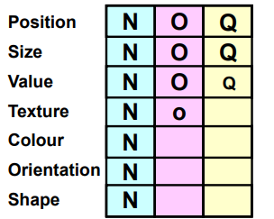
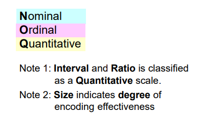
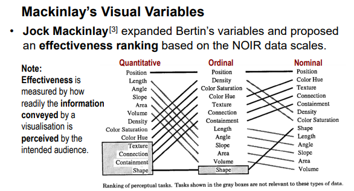

# 数据可视化笔记

## 第一章：介绍：

### 1.最好的可视化方案依赖于：

    1.数据类型

    2.上下文和数据间关系

    3.可视化本身的目的

## 第二章： 数据属性

#### 1. 基本的数据属性（noir scale/measurement level）：1. nominal 2. ordinal 3. interval 4. ratio

如何区别：

没顺序，没重叠，运算只有等于，完全靠枚举的就是nominal；

没符号，运算只有大于小于等于，只有顺序的就是ordinal，比如abcd；

有效的运算符增加了 +- 号，值之间的差值是可以量化的，有意义的。比如摄氏度。0值本身并不是真的没有的意义。这就是interval

有乘除运算，有真正的0值，比如高度，重量这些，就是ratio。

### 2. 一些特殊的data属性及使用的图类型：data attribute:

Hierarchical data: tree diagram

Temporal data：line, bar, stacked area, scatter, polar area diagram

Spatial data: geographical maps, bubble chart, heat map.

### 3. 数据维度：

1维，2维，3维，n维，这会影响选择的图表类型。

多维以上的scatter比较常见，最好不要超过7维

### 4. Data Wrangling

工具： pandas

基本操作： reshape, extracting subset, sort, replace nan values

reshape: long form to wide form (pivot), wide form to long form (melt)

# 第三章： 可视化编码

### 1. Bertin's visual variables:

Channels: position, size, shape, value, color, orientation, texture.

Visual marks: Points, lines, areas.

### 2. Mackinlay's visual variables:(更合理更广泛)

它揭示了：对于不同属性的数据，channel效果也会不同。

任何时候，position都是最容易区分的。

此外，颜色、纹理等对于nominal有优势，但是对于可量化的数据没有优势。

#### 冗余编码：

我们可以通过超过一个channel来表示一种变量。

这样会使得图像更加明显。

### 3. 图表解构

过程主要目的是分析可视化编码，以及借鉴以学习如何自己编码。

1. 图像中有什么变量
2. 它们的数据noir scale是怎样的。
3. 将变量与它们的encoding一一对应起来。

# 第四章：可视化工具：

### 如何选择合适的工具：

1. 根据输出情境：web，pdf还是嵌入app?
2. 根据展示的格式类型：map，网址，文字等，有些工具可能不支持。
3. 互通性：能否便捷的操作数据格式
4. 数据探索：是否便于探索数据特征。
5. 简单性：操作简单易上手
6. 可共享性
7. 持久性

### 合适工具举例：

bokeh, seaborn, pandas, matplotlib.

推荐python pkg

Geospatial Data: GeoPandas, Geoplot.

Textual Data: WordCloud,
